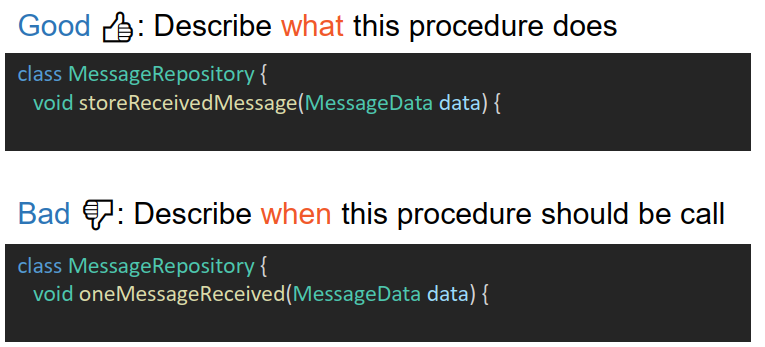
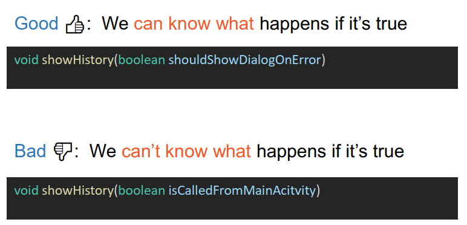
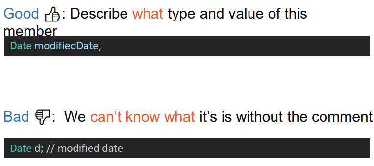
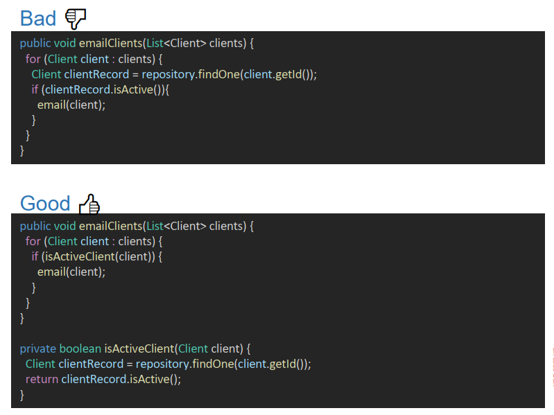
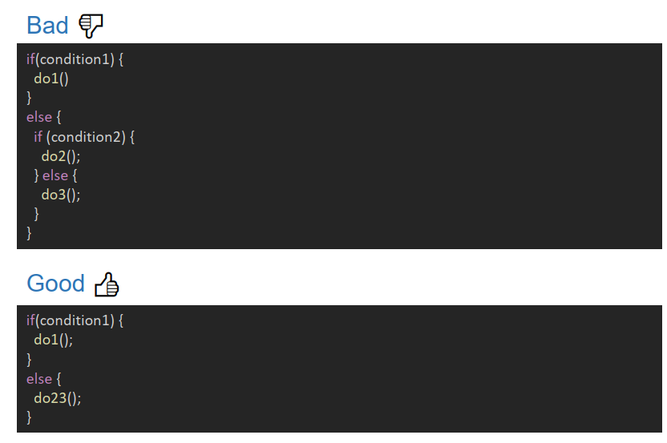
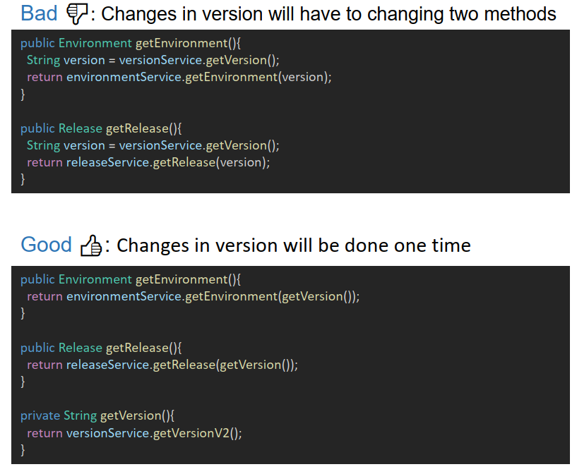
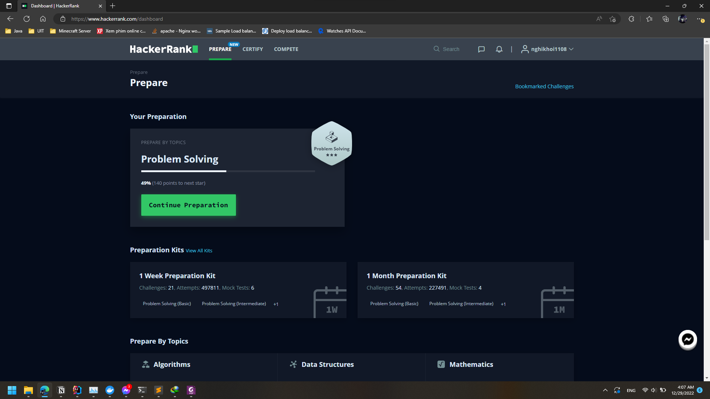
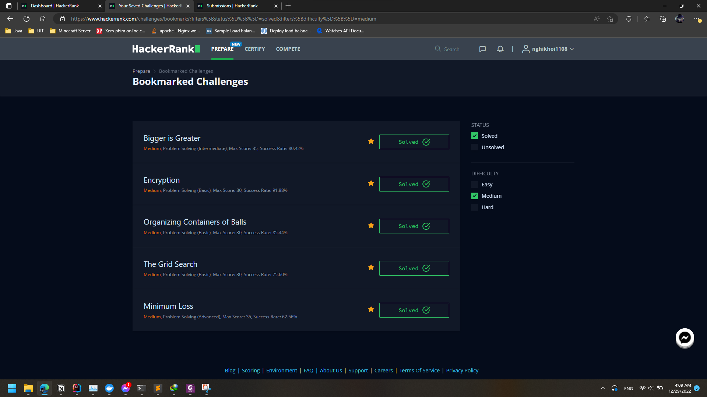

# Report: Module 2
## Design Pattern & Clean Code
### a. Nêu các 05 Design pattern hay dùng (ít nhất có Dependency Injection, Factory, Singleton, Builder...) và code minh họa
- Singleton: đảm bảo chỉ duy nhất **một thể hiện (instance)** được tạo ra và nó sẽ cung cấp cho bạn một method để có thể truy xuất được thể hiện duy nhất đó mọi lúc mọi nơi trong chương trình.
- Builder: được tạo ra để xây dựng một đôi tượng phức tạp bằng cách sử dụng các đối tượng đơn giản và sử dụng tiếp cận từng bước, việc xây dựng các đối tượng đôc lập với các đối tượng khác. Được xây dựng để khắc phục một số nhược điểm của Factory Pattern và Abstract Factory Pattern khi mà Object có nhiều thuộc tính.
- Factory: sử dụng 1 class để tạo đối tượng mà không để lộ logic tạo đối tượng ở phía người dùng và tham chiếu đến đối tượng mới được tạo ra bằng cách sử dụng một interface chung.
- Proxy: là mẫu thiết kế mà ở đó tất cả các truy cập trực tiếp đến một đối tượng nào đó sẽ được chuyển hướng vào một đối tượng trung gian (Proxy Class). Mẫu Proxy (người đại diện) đại diện cho một đối tượng khác thực thi các phương thức, phương thức đó có thể được định nghĩa lại cho phù hợp với múc đích sử dụng.
- Dependency Injection: là một kĩ thuật trong đó một object (hoặc một static method) cung cấp các dependencies của một object khác. Một dependency là một object mà có thể sử dụng (một service)
### b. Thế nào là clean code? Nêu các ví dụ để clean code.

Khái niệm: clean code là code đọc dễ hiểu và dễ sửa đổi
Sao lại quan tâm clean Code:
- Theo thống kê clean code làm giảm 90% thời gian đọc code
- Bạn có thể chính là người tiếp theo phải đọc lại code của chính bạn
- Bad code thường sẽ dẫn bạn đến ngõ cụt
- 5 phút clean code có thể giúp bạn tiết kiệm 1 tiếng cho cả team
Làm sao để clean code:
- Tuân theo các quy ước chung
- Clean code mỗi lần bạn code
- Đổi tên biến
- Thêm comment/test
- Xóa bỏ các biến dư thừa
- Tách nhỏ các function to ra thành các function nhỏ
- ...

Các ví dụ:

	
	 

 

	
	 

 

	
	 

 

	
	 

 

	
	 

 

	
	 

 

## Cấu trúc dữ liệu
### Probabilistic algorithms có tính chất thế nào? Nêu cách thức hoạt động của Bloom Filters, Cuckoo Filters, Count Min Sketch, HyperLogLog)
- Tính chất của Probabilistic algorithms:
  - Sử dụng các kiến thức xác suất thống kê.
  - Các thuật toán đều mang tính trade-off giữa hiệu năng và bộ nhớ.
  - Độ chính xác của kết quả mang tính tương đối.
  - Nhìn chung các thuật toán xác suất có hiệu năng và bộ nhớ tối ưu nhiều lần hơn so với các thuật toán thông thường.
- Bloom Filter
	- Mục đích: để xác định xem một object có "khả năng" tồn tại hay không
	- Trả về: có thể tồn tại hoặc chắc chắn không tồn tại
	- Các biến:
		- m: độ dài dãy bool
		- k hàm hash với input là object và output là 1 số index < m
	- Hoạt động:
		- Sử dụng dãy boolean độ dài m để kiểm tra
		- Object được truyền qua k hàm hash đã được setup trước thành các số index trên dãy bool
		- Nếu tồn tại 1 index tương ứng với 1 giá trị false trên dãy bool thì có nghĩa là chắc chắn Object không tồn tại
	- Tổng quan:
		- Độ hiểu quả được đánh giá qua việc kiểm tra object không tồn tại
		- Độ hiệu quả phụ thuộc vào m và k

- Cuckoo Filter
	- Tương tự Bloom Filter
	- Hoạt động:
		- Thay vì sử dụng 1 mảng bool thì Cuckoo sử dụng 1 ma trận bool
		- i, j tương ứng với hàng và cột
		- i = h1(x) = hash(x)
		- j = h2(x) = h1(x) XOR hash(fingerprint(x))

- CountMinSkecth
	- Mục đích: đếm số lần "action" của 1 object
	- Trả về: số lần action. Rủi ro: Giá trị return >= giá trị thực tế
	- Hoạt động:
		- Sử dụng mảng đếm độ dài m hoặc ma trận đếm n cột m dòng
		- k hàm hash với return của mỗi hàm là xác định index của object trên ma trận
		- với mỗi kết quả trả về của mỗi hàm hash thì counter + 1
		- Cách lấy: sử dụng lại k hàm hash sẽ ra đc k index trên ma trận. Sử dụng index đó để truy vấn từ ma trận ta sẽ được k giá trị counter, khi đó ta lấy min của k giá trị đó
	- Tổng quan:
		- Rủi ro phụ thuộc vào k và độ lớn của ma trận

- HyperLogLog
	- Mục đích: đếm số lượng unique của một tính chất từ một dataset cực kì lớn
	- Trả về: số lượng unique tương đối
	- Hoạt động:
		- Sử dụng hàm hash để đưa object thành một dãy bit
		- Dựa vào kết luận rằng với mỗi dãy bit có dãy số 0 liên tục bắt đầu từ trái sang dài nhất (i số 0) thì theo xác suất sẽ phải gặp thêm 2^i số nữa mới có thể gặp một số có dãy bit tương tự. Khi đó có thể dự đoán tương đối số lượng unique theo phần tử có dãy bit 0 dài nhất.
		- Từ ý tưởng trên thì thuật toán sẽ cài đặt k hàm hash để tính toán
		- Kết quả sẽ là từ kết quả của k hàm hash được đưa vào công thức tính trung bình phân phối để đưa ra sai số thấp hơn.
	- Tổng quan:
		- Thuật toán sử dụng bộ nhớ cực kì thấp (với bộ data > 10^9 dòng thì có thể chỉ cần 15KB)

### Trie để làm gì?
Trie là một cấu trúc dữ liệu dùng để quản lý một tập hợp các xâu. Trie cho phép:
-   Thêm một xâu vào tập hợp
-   Xóa một xâu khỏi tập hợp
-   Kiểm tra một xâu có tồn tại trong tập hợp hay không.

### Hashing có 2 loại là crypto & non-crypto hashes. 2 loại này khác nhau như thế nào? Viết chương trình benchmark để giữa md5 và xxhash, xem trong N phút, hash nào thực hiện được nhiều hơn.
- Non-crypto hashes chú trọng vào việc tránh sự trùng lặp. Một số thường dùng để phân tích sự thay đổi của dữ liệu.
- Crypto hashes đều mang các tính chất đặc trưng của non-crypto hashes nhưng sẽ có thêm các thuộc tính bảo mật vào. Crypto hashes có một số tính chất đặc trưng thêm như sau:
	- Với các input giống nhau đều sinh ra một kết quả giống nhau.
	- Mỗi thay đổi của input đều làm thay đổi lớn đối với kết quả đầu ra.
	- Sẽ không thể "đoán" input đầu vào từ kết quả đầu ra.
	- Độ chống đụng độ (trùng lặp) cao.
	- Không thể tìm được input từ ouput.
	- Thuật toán hash không thể chạy ngược để lấy input.

Kết quả benchmark:
||MD5|XXH32|XXH64|
|--|--|--|--|
|1m|2552719|2632915|2646351|
|5m|12278336|12691884|12765352|
|15m|35191158|36358042|36393868|

## Từ điển
### Tối ưu
- Binary Search
- Bloom Filter
- Hashtable
- Trie

Dựa theo log thì sau khi áp dụng Bloom Filter, so với tìm kiếm linear thì:
- Hiệu năng nhanh gấp 1800 lần so với các trường hợp check false
- Bộ nhớ chiếm ít gấp 3 lần

## Hackerrank

	
	 

 

	
	 

 